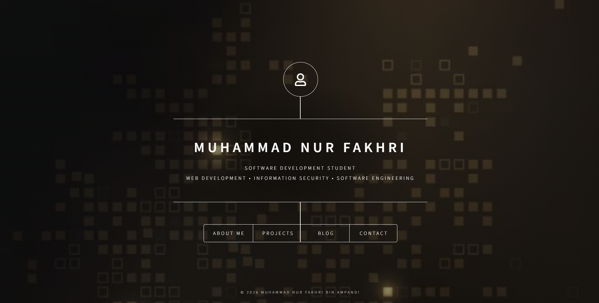

# Muhammad Nur Fakhri Portfolio

## Description

This is a personal portfolio website developed using HTML, CSS, and JavaScript. The website showcases my profile, academic projects, technical skills, and learning experiences as a Software Development student at Universiti Sultan Zainal Abidin (UniSZA).

---

## Features

- Personal Profile Section
- Project Showcase
- Blog Section
- Contact Information
- Responsive Design
- GitHub Pages Deployment

---

## Technologies Used

- HTML5
- CSS3
- JavaScript
- Git
- GitHub
- GitHub Pages
- HTML5 UP Dimension Template

---

## Screenshots

### Homepage

---

## How to Run the Project

1. Download or clone the repository.
2. Open the project folder.
3. Open `index.html` using a web browser.

OR

1. Open the project in Visual Studio Code.
2. Use the Live Server extension.
3. Open `index.html` with Live Server.

---

## Demo Link

Website:
https://animuzr.github.io/Portfolio/

GitHub Repository:
https://github.com/Animuzr/Portfolio